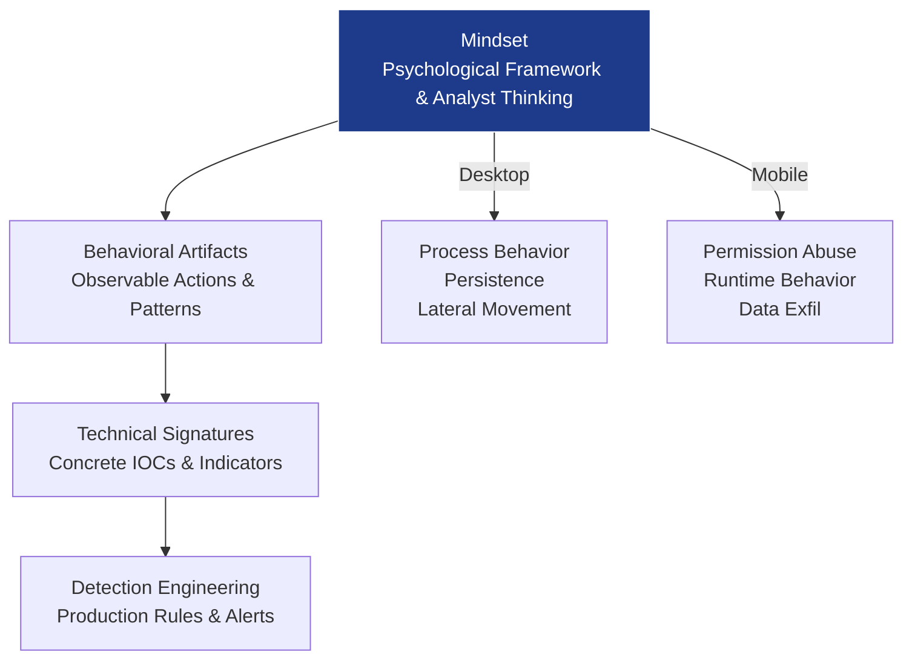

# MindForge Threat Analyst

A practical, open-source Threat Analyst Model developed through a full year of iterative, hands-on detection engineering.

## Core Pipeline
**Mindset → Behavioral Artifacts → Technical Signatures → Detection Engineering**

