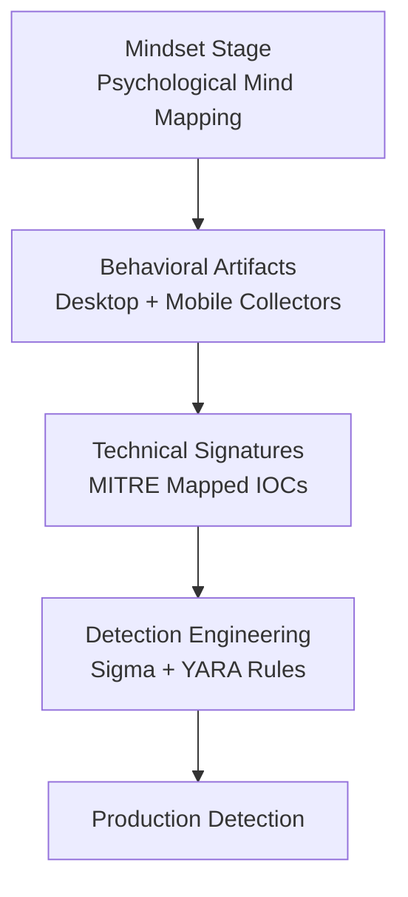

# MindForge Threat Analyst

A practical, open-source Threat Analyst Model developed through a full year of iterative, hands-on detection engineering.

## Pipeline Diagram

## New in Round 4
- More real-world examples
- Real Sigma rules in /rules/
- GitHub Actions CI workflow
- Topics added for visibility

## Topics
`cybersecurity` `threat-hunting` `detection-engineering` `malware-analysis` `sigma-rules` `mitre-attack`

## Screenshots
Run `python main.py` to see the pipeline in action.

Built from my hands-on experience.
— Noah
